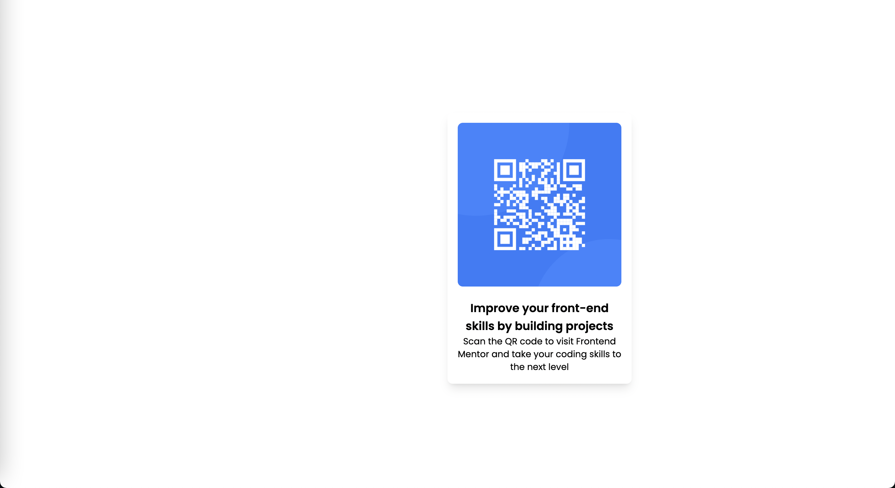

# Frontend Mentor - QR code component solution

This is a solution to the [QR code component challenge on Frontend Mentor](https://www.frontendmentor.io/challenges/qr-code-component-iux_sIO_H). Frontend Mentor challenges help you improve your coding skills by building realistic projects.

## Table of contents

- [Frontend Mentor - QR code component solution](#frontend-mentor---qr-code-component-solution)
  - [Table of contents](#table-of-contents)
  - [Overview](#overview)
    - [Screenshot](#screenshot)
    - [Links](#links)
  - [My process](#my-process)
    - [Built with](#built-with)
    - [What I learned](#what-i-learned)
    - [Continued development](#continued-development)
    - [Useful resources](#useful-resources)
  - [Author](#author)

## Overview

### Screenshot



### Links

-   [Solution URL](https://github.com/a-hsu/frontend-mentor/tree/main/challenges/qr-code-component-main)
-   [Live Site URL]: (https://a-hsu.github.io/frontend-mentor/challenges/qr-code-component-main/index.html)

## My process

### Built with

-   Semantic HTML5 markup
-   TailwindCSS
-   CSS Grid

### What I learned

-   Used grid for the first time
-   Boxshadow != dropshadow
-   TailwindCSS class names
-   That I need more practice so that it becomes second nature

To see how you can add code snippets, see below:

```html
<div
    class="grid rounded-lg p-4 grid-rows-1 gap-0 absolute w-72 shadow-lg inset-x-1/2 top-44"
>
    <!-- Image -->

    

    <!-- Text -->
    <div>
        <h1
            class="text-lg font-semibold font-outfit col-span-1 text-center pt-5"
        >
            Improve your front-end skills by building projects
        </h1>
        <p class="font-outfit text-gray col-span-1 text-center text-sm">
            Scan the QR code to visit Frontend Mentor and take your coding
            skills to the next level
        </p>
    </div>
</div>
```

### Continued development

-   Understand of grid and flexbox
-   Box model and how divs work
-   How to center a div :D
-   How to set background color

### Useful resources

-   [TailwindCSS Docs](https://tailwindcss.com/docs/)

## Author

-   Frontend Mentor - [@a-hsu](https://www.frontendmentor.io/profile/a-hsu)
<!-- -   Website - [AndrewHsu](https://www.your-site.com)

<!-- ## Acknowledgments -->
